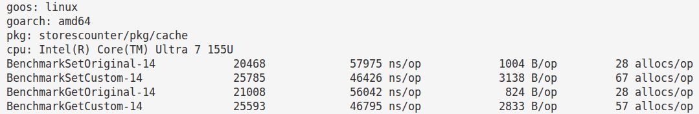
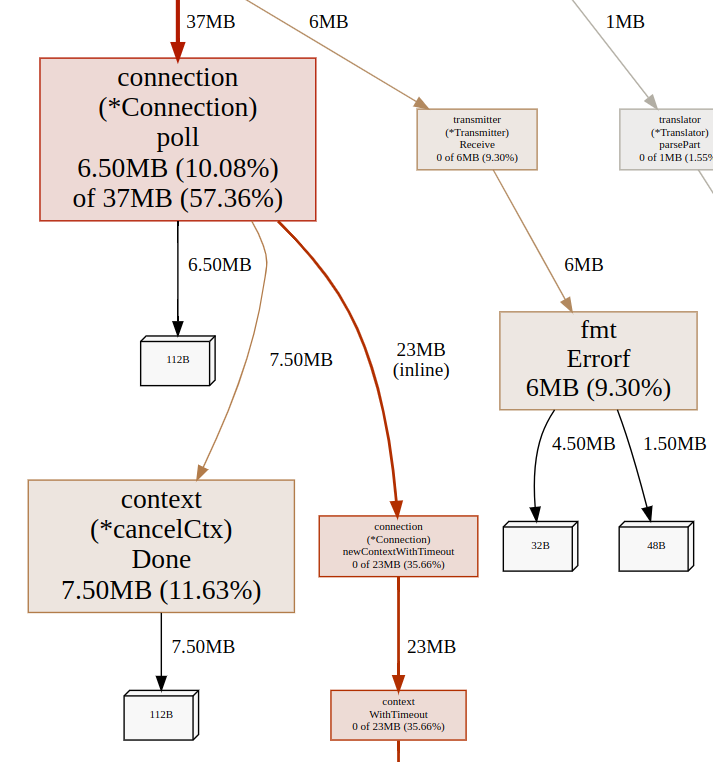
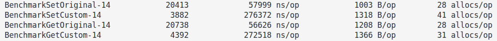
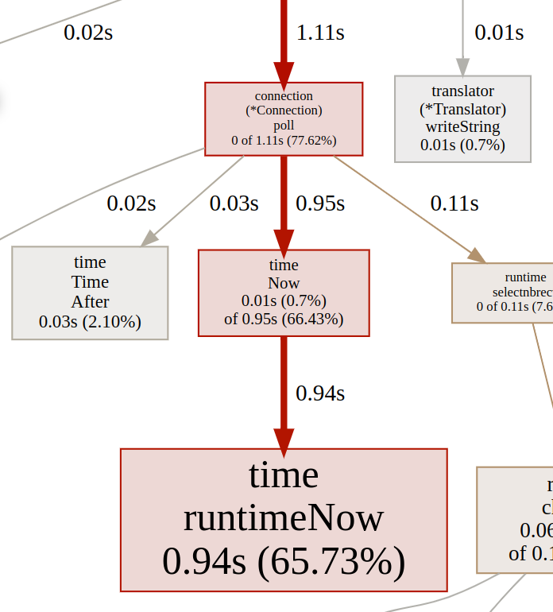

# История про оптимизацию

Небольшой рассказ об итогах оптимизации после сравнения с оригинальным [go-redis](https://github.com/redis/go-redis)

## Первая итерация

При первом сравнении с [go-redis](https://github.com/redis/go-redis) (в сравнительных тестах указан как Original) оказалось, что данный драйвер (Custom) работает быстрее, но потребляет сильно больше памяти и создает гораздо больше аллокаций



### Причины лишних аллокаций

Профилирование показало, что среди прочего драйвер создавал много аллокаций из-за использования контекста с таймаутом при поллинге.
Также были лишние аллокации из-за оборачивания часто встречаемых ошибок в отправке/получении (transmitter)




Как было в коде:
```go
func (c *Connection) poll(eventType string) error {
    ...
    
    ctx, cancel := context.WithTimeout(context.Background(), c.opts.PollingTimeout)
    defer cancel()

    for {
        if ctx.Err() != nil {
            return models.ErrPollTimeout
        }
        
        err = c.poller.Add(pUnit)
        if err != nil {
            ...
        }
        break
    }

    select {
    case err = <-pUnit.ResultChan:
        ...

    case <-ctx.Done():
        // таймаут истек
        ...

    }
    ...
}
```

### Решение

В первую очередь убрал оборачивание ошибок в отправке/получении (transmitter). Затем заменил контекст с таймаутом на `time.Now().After()`

После оптимизации код стал таким:
```go
func (c *Connection) poll(eventType string) error {
	...
	deadline := time.Now().Add(c.opts.PollingTimeout)

	for {
		if time.Now().After(deadline) {
			return models.ErrPollTimeout
		}
		
		err = c.poller.Add(pUnit)
		if err != nil {
			...
		}
		break
	}

	for {
		select {
		case err = <-pUnit.ResultChan:
			...

		default:
			if time.Now().After(deadline) {
				// таймаут истек
                ...	
			}
			continue

		}
		break
	}
    ...
}
```

С аллокациями теперь стало гораздо лучше, но драйвер стал работать медленее оригинального [go-redis](https://github.com/redis/go-redis):



## Вторая итерация

Возникла проблема замедления работы. CPU профиль показал, что много времени уходит на вызов `time.Now()`



На вызов уходило много времени, потому что горутина крутилась в бесполезном цикле и забирала процессорное время, не отдавая его другим горутинам

### Решение

Было добавлено принудительное переключение на другие горутины через `runtime.Gosched()`

```go
func (c *Connection) poll(eventType string) error {
	...
	deadline := time.Now().Add(c.opts.PollingTimeout)

	for {
		if time.Now().After(deadline) {
			return models.ErrPollTimeout
		}
		
		err = c.poller.Add(pUnit)
		if err != nil {
			...
		}
		break
	}

	for {
		select {
		case err = <-pUnit.ResultChan:
			...

		default:
			if time.Now().After(deadline) {
				// таймаут истек
                ...	
			}
			runtime.Gosched()
			continue

		}
		break
	}
	...
}
```

## Итоги

По итогу получилось, что драйвер работает быстрее, но в то же время потребляет немного больше памяти и создает немного больше аллокаций чем [go-redis](https://github.com/redis/go-redis)

