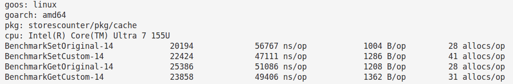

# Redis driver

Учебный драйвер с минимальным функционалом, реализован через прямые системные вызовы и собственный poller (epoll).
Поддерживается только ОС Linux. Можно использовать конкурентно, но все потоки проходят последовательно через одно соединение. По умолчанию включается RESP3

Доступны команды:

- Ping - проверяет соединение с сервером Redis
- Hello3 - проверяет соединение, включает протокол RESP3 и возвращает некоторую информацию о клиенте
- SetValueForKey - устанавливает значение для ключа, в качестве значения поддерживаются только `string` и `[]byte`
- GetValueByKey - возвращает значение по ключу, возвращается `[]byte`
- Close - завершает работу

**Ограничения**:

- Поддерживается только Linux
- Необходим Redis 6.0 и выше
- На текущий момент только одиночное соединение
- Нет авторизации и выбора конкретной БД redis
- Не поддерживается работа с кластером
- Буферы отправки/получения могут динамически увеличиваться до указанных максимумов, но на текущий момент они никогда не уменьшаются

## Сравнение с оригинальным [go-redis](https://github.com/redis/go-redis):

(go-redis указан как Original)

## Планы на будущее

* оптимизация аллокаций (в частности парсинг)
* TLS
* пул соединений
* Pub/sub
* streaming
* логирование
* транзакции
* pipeline
* io_uring
* авторизация
* выбор БД redis